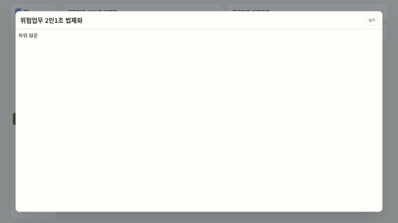
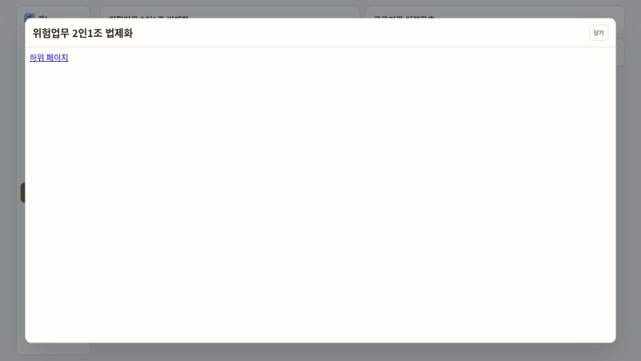

# APP-게시판iframe: 본문 표시와 뒤로 가기 수정

2026-10-09, Codex 클라우드. 착수 시 fetch한 origin/main은 `db81bf582d541f4b38028424837e80e77fb8fc4c`(#453 merge). 새 브랜치 `codex/app-board-iframe`, PR 번호와 최종 SHA의 CI는 PR 본문·댓글에 연결한다. merge하지 않는다.

## 근거와 원인

[TEST-간헐실패정리 2차](test-flaky-cleanup-2.md)의 수치·trace·영상·실제 화면 기록에서 출발했다. clean main 반복 재조사를 하지 않았다. 기존 세 테스트의 수정 전 수치는 이 기록의 `9f44ecd0` 측정이며 착수 main을 새로 측정한 수치가 아니다.

- 사실: 기존 코드가 연결된 동일 iframe에 blank → 로딩 srcdoc → 본문/오류 srcdoc 탐색을 연달아 요청했다. HTTP200·최종 srcdoc 뒤에도 실제 본문은 로딩 문서인 실패가 기록돼 있다. detailEpoch는 응답을 막지만 이미 요청한 문서 탐색 순서를 제어하지 않았다.
- 사실: 기존 390px 화면은 본문 표시 뒤 Back1회에도 상세·overlay가 유지되고 부모 popstate가 없었다. 이번 수정 전 회귀 검사도 본문 표시까지 성공한 뒤 hidden 검사에서 실패했다.
- 사실: 직접 `?view=pages` 진입에서는 게시판 listener가 공용 이력 listener보다 먼저 등록된다. 초기 수정은 Back으로 숨김만 되고 srcdoc·포커스가 정리되지 않아 새 검사에서 실패했다. microtask만으로 모든 native popstate listener 뒤 실행을 보장하는 방식도 이 검사를 통과하지 못했다. 최종 구현은 양쪽 등록 순서를 처리한다.
- 추정: 기존 본문 불일치는 연속 탐색 완료 경쟁, Back 불동작은 iframe 자식 이력에 의한 traversal 가로채기와 관련된다. 정확한 Chromium 내부 역전 과정과 두 증상의 직접 원인이 같은지는 확정하지 않는다. 최종 구현은 연속 탐색과 이전 자식 context를 제거한다.

## 구현과 범위

`app/web1-board.js`의 replaceReader는 기존 iframe을 복제하되 srcdoc·메타데이터를 지운 **미연결 요소**에 최종 HTML을 한 번 설정한 뒤 연결한다. 요청 대기는 iframe 밖 상세의 role=status가 표시한다. 현재 reader는 요청 동안 유지하고 새 reader는 준비 상태로 연결한다. 새 문서의 load에서 epoch·준비 요소를 확인한 뒤 기존 reader를 제거하고 새 요소에 공개 id를 부여한다. 이미 연결한 새 iframe은 이동시키지 않는다. 닫기·다음 요청은 준비 요소도 제거한다. 성공·오류 응답과 문서 준비 완료 모두 detailEpoch로 오래된 작업을 차단한다.

`web1-board.js`의 게시판 popstate 처리는 이미 숨겨졌으면 소유자 정리를 실행하고, 먼저 등록된 경우 기존 공용 `kptuHistoryClosing='pop'` 표시로 닫는다. 추가 Back 없이 epoch·iframe·접근성 상태·포커스를 정리한다. `mobile-modal-history.js`는 변경하지 않았다. 상세 상태 소유자는 게시판 하나이며 MutationObserver·setTimeout·지연 덮어쓰기를 추가하지 않았다.

로딩은 iframe 밖으로 이동했다. 오류 안내는 기존 :211의 iframe 안 문구·링크 계약을 유지하기 위해 새 iframe의 최종 문서 한 번으로 표시한다. 원문 요청의 URL·cache·credentials·mode와 sandbox는 그대로이며 allow-same-origin을 추가하지 않는다. DB·RLS·Edge·운영 접속·다른 iframe 화면은 변경하지 않는다.

`app/index.html:128`과 `app/web1-board.css:14`는 로딩 상태와 reader의 flex 영역을 추가한다. 기존 모바일 전체 화면 크기·제목 숨김·카드 스타일은 유지한다.

## 검사와 반복 결과

수치는 실패/실행이다. 저장소 고정 Playwright1.55.0, 설치 Chromium151.0.7922.173, Node24.19.0, 재시도0. assertion 기본5000ms·test 기본30000ms, trace/video retain-on-failure. 관련 spec의 Supabase·원문 fixture만 사용했다. 초기 등록 순서 보강 전 중단한 배치(24통과·1중단·225미실행)는 최종 각50회에 포함하지 않는다.

| 테스트(실제 파일 행) | 수정 전 W1 | 수정 전 W4 | 수정 후 W1 | 수정 후 W4 |
| --- | --- | --- | --- | --- |
| 원문5개 표시·목록 복귀 (:105) | 18/20 (90%) | 13/20 (65%) | 0/50 | 0/50 |
| 내부 링크 (:190) | 9/20 (45%) | 7/20 (35%) | 0/50 | 0/50 |
| 원문 실패 안내 (:211) | 5/20 (25%) | 10/20 (50%) | 0/50 | 0/50 |
| 본문 뒤 Back1회·목록 유지·포커스: 홈 경유 (:223) | 새 검사1/1 실패 | 미측정 | 0/50 | 0/50 |
| 본문 뒤 Back1회: 직접 pages 진입 (:223) | 초기 수정1/1 정리 실패 | 미측정 | 0/50 | 0/50 |
| 늦은 첫 응답이 다음 글을 덮지 않음 (:248) | 기존 epoch 방어 있음; 새 외부 로딩 검사1/1 실패 | 미측정 | 0/50 | 0/50 |

기존 :105·:190·:211 테스트 블록은 착수 main과 바이트 단위 동일 확인. :223의 새 Back 검사는 390px·본문 실제 표시 후 한 번의 history.back만 호출하고 상세 숨김·목록5개·overlay 해소·srcdoc 제거·트리거 포커스를 검사한다. 홈 경유와 직접 진입을 모두 검사한다. 기존 원문 응답 전 Back 대조 검사도 보존했다.

:248의 새 검사는 첫 글 응답을 gate하고 닫기·overlay 해소 후 두 번째 글 응답을 먼저 표시한다. 첫 응답을 풀고 앱의 response.text 소비 continuation 뒤 test-only acknowledgement를 확인한 다음 두 번째 본문·canonical·source가 유지되는지 검사한다. 타이머/임의 시간 대기를 쓰지 않는다. 초기 구현의 성공 경로 epoch 검사만 임시 제거한 mutation은 실제 `late first detail`로 덮여 실패(1/1)했고 원래 방어를 복원했다. 새 검사가 경쟁 방어 제거를 탐지한다는 근거다. 최종 문서 준비 단계에서도 확인하도록 응답 소비 뒤 iframe이1개로 정리된 것을 검사한 다음 실제 본문을 확인한다. 최종 구현의 응답·load 양쪽 epoch publication 방어를 제거한 mutation도 실제 늦은 본문으로 덮여1/1 실패했고 복원 후 전체11/11 통과했다.

시간·크기 한도 완화, timeout·재시도 증가, 검사 삭제·skip, 앱 API 지연값 변경 없음. 캐시 구조 검사에서 기존 `frame.srcdoc=injectReaderBridge` 문자열은 같은 원문 bridge 주입을 실행하는 `replaceReader(injectReaderBridge` 호출로 기대값만 맞췄다.

초기 구현 각50회에서는 원문·오류·Back2경로·늦은 응답은 각각0/50, 내부 링크는2/50 실패였다(전체298/300 통과, 594.4초). 이 수치를 최종 성공 집계로 쓰지 않는다. repeat39 trace는 하위 원문 HTTP200·본문 표시 뒤에도 클릭 명령이30초 timeout, repeat44는 클릭 완료 뒤 하위 요청 없음·첫 문서 유지였다. test-only 입력 기록 대조20회에서도1회 click 입력/내부 이동 메시지/하위 본문은 모두 발생했으나 클릭 명령 timeout이었다. 즉시 sender 제거와 입력 완료의 충돌이 관련된다는 정황이며, missing-request 실패의 정확한 compositor 내부 원인은 추정이다. 최종 문서 load로 전환을 묶어 iframe을 입력 도중 즉시 버리지 않고 문서 준비 뒤 활성화하도록 보완했다. 임의 시간·재시도 없이 실제 문서 준비 완료에 맞춘다. 보완 후 내부 링크만 workers=4 각20회0실패, 전체11/11 통과를 확인했다. 최종 각50회는 workers=4 → workers=1 순서로 보완 후 새로 실행한다.

초기 구현 repeat39의 마지막 trace 화면은 하위 본문을 표시하지만 클릭 명령은 끝나지 않았다. repeat44는 하위 요청 없이 첫 문서가 남았다. 다음 그림은 해당 실패 trace의 마지막 screencast이며, 입력/요청 여부는 위 trace 기록과 함께 판단했다.





반복 명령(저장소 밖 설정은 executablePath=/usr/bin/chromium·retries=0·retain-on-failure):

```sh
npx playwright test --config=/tmp/app-board-iframe/playwright.config.cjs web1-board.spec.mjs \
  --grep='Web2 board renders|Web1 board internal links|Web1 board source failure|loaded mobile board|late first board' \
  --workers=1 --repeat-each=50
# 같은 grep/repeat 조건에서 --workers=4
```

최종 구현 게시판 전체11/11, 캐시 기대값 관련7/7, node70/70, 정적 smoke·HTTP smoke·git diff --check·loader-cache 검사 통과. 최종 workers=4는6개 각각0/50, 전체300/300 통과(386.4초), skip·flaky·재시도0. workers=1도6개 각각0/50, 전체300/300 통과(564.0초), skip·flaky·재시도0. 최종 합계600/600. [최종 JSON 집계](assets/app-board-iframe/repeat-summary.json)는 각 검사의 결과1개(재시도 없음)·50회 통과와 측정 중 코드/검사 해시 동일을 검증해 작성했다. CI는 최종 SHA의 PR 본문·댓글에 기록한다. 병렬→직렬 순서로 별도 실행하며 코드·기본 한도는 동일하다. 별도 읽기 전용 코드 검토에서 등록 순서·늦은 응답 검사 보강 뒤 남은 중요 지적 없음.

## 캐시

| 자원 | 이전 → 새 버전 | 참조 |
| --- | --- | --- |
| web1-board.js | 3 → 4 | view-loader.js |
| web1-board.css | 6 → 7 | view-loader.js, styles.css |
| view-loader.js | 105 → 106 | loader-v2.js |
| loader-v2.js | 337 → 338 | app.js, index.html preload |
| app.js | 225 → 226 | index.html |
| styles.css | 74 → 75 | login/index.html |
| mobile-modal-history.js | 3 유지 | 공용 파일 변경 없음 |

기대값은 app-smoke-check.yml·page-core-structure·startup-performance·calendar-hotfix·task-layout-groups에 함께 반영했다. 캐시 검사 통과(운영 참조379개 확인).

## 남은 확인

PR CI의 저장소 고정 Chromium140 결과는 PR 생성 뒤 최종 SHA 기준으로 확인해 PR 본문·댓글에 남긴다. 설치 Chromium151 반복 결과를 실제 폰/WebView/다른 브라우저의 보증으로 일반화하지 않는다. 사용자 폰에서 본문·내부 링크·닫기·Back1회 확인은 merge 뒤 확인 항목이다. TEST 2차의 홈 칩·Google 연속 완료·DB20연결·기존 대기3개는 이번 범위 밖이며 실행·수치 갱신·수정하지 않았다. 다른 iframe 화면도 범위 밖이다.
