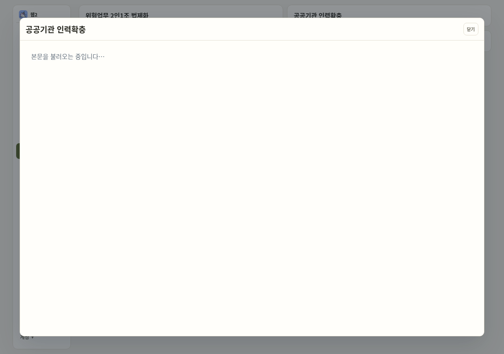
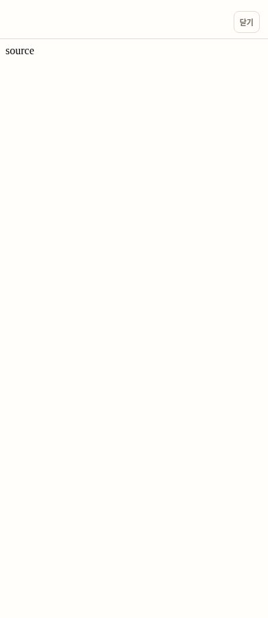

# TEST-간헐실패정리 2차 조사

📱 폰 가능 · Codex 클라우드 · 2026-10-09. 기준 origin/main `9f44ecd0edcdb978510377cf0165df99bda16206`(#452), branch `codex/test-flaky-cleanup-2`.

게시판의 실제 화면 문제와 본문 로드 후 뒤로 가기 문제를 재현했다. 사용자 지시의 “원인이 앱 코드 버그면 수정하지 말고 정지·보고”에 따라 테스트·앱 수정과 우선순위 2~5의 실행을 중단했다. 아래는 **조사 결과이며 안정화 완료 보고가 아니다**. 원장에 `APP-게시판iframe` 대기 작업으로 분리한다.

## 측정 조건과 결과

변경 없는 지정 main 트리, 저장소 고정 Playwright `1.55.0`, 설치 Chromium `151.0.7922.173`, Node `24.19.0`, 재시도 0. static server `127.0.0.1:8123`, 기존 Supabase/원문 fixture 응답만 사용했다. production 접근 없음. 각 세 테스트를 한 묶음으로 `--repeat-each=20 --workers=1`과 `--repeat-each=20 --workers=4`로 순서대로 실행했다. trace·video는 `retain-on-failure`; 기본 assertion 5000ms·test 30000ms와 기존 검사 원문을 유지했다.

표의 수치는 실패/실행이며 timeout도 실패에 포함한다. 직렬 28/60 통과·32/60 실패(474.3초), 병렬 30/60 통과·30/60 실패(136.2초). setup의 ffmpeg 경로 오류, 중단한 초기 진단, 별도 대조 실행은 아래 각20회 분모에 포함하지 않는다. 직렬 측정 중 별도 소형 iframe/실제 앱 진단도 실행했으므로 CPU를 격리한 성능 측정은 아니다. CI Chromium140에 이 실패율을 일반화하지 않는다.

| 테스트 이름(원문 main 행) | 수정 전 workers=1 | 수정 전 workers=4 | 원인: 사실 / 추정 | 처리 | 수정 후 같은 조건 각50회 |
| --- | --- | --- | --- | --- | --- |
| `Web2 board renders all five business pages from repository HTML source and returns to the list` (`web1-board.spec.mjs:105`) | 18/20 (90%) | 13/20 (65%) | 사실: 원문 HTTP200·최종 srcdoc 갱신 뒤에도 iframe 본문이 로딩 문서에 머무름. 추정: iframe의 연속 탐색 완료 경쟁 | 앱 버그 분리·미수정 | 미실행(수정 없음·정지) |
| `Web1 board internal links stay in the reader and load the linked repository file` (`:190`) | 9/20 (45%) | 7/20 (35%) | 사실: 첫 childLink 관측 timeout 7·6회, 클릭 후 nestedBoard 본문 관측 실패 2·1회. 추정: 같은 문서 전환 경쟁 | 앱 버그 분리·미수정 | 미실행(수정 없음·정지) |
| `Web1 board source failure shows a controlled reader error instead of a browser Not Found page` (`:211`) | 5/20 (25%) | 10/20 (50%) | 사실: HTTP404 fixture 뒤에도 오류 안내 대신 로딩 문서가 보이는 실패 snapshot. 추정: 같은 문서 전환 경쟁 | 앱 버그 분리·미수정 | 미실행(수정 없음·정지) |
| `organization chips fit, preserve order and non-overlapping targets at 390` / `at 1440`; 후보 `home chips and update rows open the existing detail dialogs` | 미측정 | 미측정 | #449 PR 보고는 `home-selection-sheet.spec.mjs:27`의 390px 좌표 클릭을 지목. 이번 반복 실행으로 특정하지 못함 | 앱 버그 정지 뒤 미실행·대기 | 미실행 |
| Google 후보 `repeated taps save in order and only the last wish`, `three quick taps that end on complete send a single save`, `a list load that answers with the old state does not undo a tap made during it`; #449 보고의 `consecutive completions keep independent three second timers` (`google-tasks-toggle.spec.mjs:298`, 검사 `:303`) | 미측정 | 미측정 | #449 PR 보고는 :303 즉시 요청 배열 비교를 지목. 비동기 요청 관측 경쟁은 추정이며 이번 반복 실행으로 확인하지 못함 | 앱 버그 정지 뒤 미실행·대기 | 미실행 |
| auth-handoff `20 simultaneous independent handlers/connections: one nonce claim and one Auth refresh` (`postgres.test.mjs:94`; CI step `single consumption across 20 real PostgreSQL connections`) | 미측정 | 미측정 | 아래 코드 읽기 참고. 실패 원인 미확정 | 앱 버그 정지 뒤 미실행·대기 | 미실행 |
| `760px enables menu swipes and 761px touch width has no menu or month swipe` (`swipe-nav-follow.spec.mjs:273`) | 이번 요청 대상 아님 | 미측정 | 1차 0/10을 이번 0/20으로 바꾸지 않음 | 앱 버그 정지 뒤 미실행·대기 | 이번 요청 대상 아님 |
| `Design System 1.0 keeps 36px top-level actions and the 32px calendar toolbar` (`design-system.spec.mjs:52`) | 이번 요청 대상 아님 | 미측정 | 1차 0/10을 이번 0/20으로 바꾸지 않음 | 앱 버그 정지 뒤 미실행·대기 | 이번 요청 대상 아님 |
| `direct session owner switch reloads without retaining the previous private DOM` (`public-workspace-auth.spec.mjs:153`) | 이번 요청 대상 아님 | 미측정 | 1차 0/10을 이번 0/20으로 바꾸지 않음 | 앱 버그 정지 뒤 미실행·대기 | 이번 요청 대상 아님 |

## 사실과 원인 한계

1. 직렬 원문 표시 실패 18건은 2in1 3·workforce 4·private-rail 5·rail-council 5·sanbyeol 1건이었다. 원문 응답은 HTTP200이고 최종 srcdoc에는 `<base>`와 fixture 본문이 있다. 실패 영상과 snapshot에서는 실제 로딩 문서가 남는다. DOM 속성 확인만으로 문서 표시가 완료됐다고 볼 수 없다.
2. 기록을 끈 workers=1 대조(각2회)도 원문 표시 2/2 실패, 오류 안내 0/2 실패였다. 별도 실제 앱 진단(trace/video 없음)은 PC에서 workforce 표시 1/5 실패, 폰에서 0/5 실패였다. PC 실패 때 srcdoc에는 본문이 있고 실제 iframe body와 screenshot은 “본문을 불러오는 중입니다…”이며 `history.state`는 `{kptuView:'pages'}`였다. 따라서 이 실패 전체를 모바일 overlay 이력 때문이라고 단정할 수 없다.
3. 별도 최소 iframe 실험에서 `src='about:blank'` → 로딩 srcdoc → fetch 응답 srcdoc 순서를 사용하면 trace 없음 1회는 본문, trace 있음 1회는 로딩 문서였다. 기록이 탐색 경쟁에 영향을 주는 정황이다. 이 1회씩의 대조로 브라우저·Playwright의 정확한 내부 결함이나 CI140 재현률을 확정하지 않는다.
4. 기록을 끈 390px 실제 앱에서 로딩 문서가 표시된 뒤 원문 응답을 풀고 본문 `source` 표시를 확인했다. 그 뒤 `history.back()` 1회와 기존 5000ms hidden assertion이 실패했다. 상세는 visible, 본문은 source, 부모 history는 `{kptuView:'pages',kptuOverlay:'web1BoardDetailModal'}`, length=5로 유지됐고 새 부모 popstate가 없었다. 닫기 버튼 뒤에는 hidden, `{kptuView:'pages'}`, length=4가 됐다. **본문 로드 후 Back 1회 불동작은 사실이며, 이번 진단에서는 닫기 후 overlay 잔존은 재현하지 않았다.**
5. 4번은 2026-10-06 원장의 “본문 로드 후 뒤로 가기 1회로 상세가 닫히지 않음”과 일치한다. iframe 경로가 공통이지만 1~3번 표시 실패와 4번 이력 실패의 직접 원인이 같다는 근거는 없다. 단순 테스트 관측 수정으로 실제 표시·뒤로 가기 결함을 해결했다고 보고할 수 없어 분리한다.





## 재현과 별도 작업 제안

원문 표시/내부 링크/실패 안내: pinned Playwright와 설치 Chromium으로 아래 main 테스트를 그대로 반복한다. 원문 fixture/검사/재시도/timeout은 변경하지 않는다. 실패 trace의 원문 응답, srcdoc 검사, iframe body와 영상 화면을 비교한다.

저장소 루트에서 `npm install --no-save --package-lock=false @playwright/test@1.55.0`으로 고정 도구를 준비하고, 설치 Chromium 및 Playwright video용 ffmpeg 경로를 확인한다. 임시 설정은 checkout 밖에 둔다.

```sh
cat > /tmp/flaky-playwright.config.cjs <<'CONFIG'
module.exports = {
  testDir: process.cwd() + '/tests/app-e2e',
  retries: 0,
  use: {
    browserName: 'chromium',
    launchOptions: {executablePath: '/usr/bin/chromium'},
    trace: 'retain-on-failure',
    video: 'retain-on-failure',
  },
};
CONFIG
npx playwright test --config=/tmp/flaky-playwright.config.cjs \
  web1-board.spec.mjs --grep 'renders all five|internal links|source failure' \
  --workers=1 --repeat-each=20 --output=/tmp/flaky-board-w1
# 동일 설정에서 --workers=4, --output=/tmp/flaky-board-w4로 실행.
```

뒤로 가기: 390px에서 로그인 fixture → 게시판 → 첫 카드 → 로딩 문서 표시 확인 → 원문 응답 → 본문 표시 확인 → 뒤로 가기 1회. 본문 응답 gate는 로딩→본문 이력 관계를 분리하기 위한 진단이며 기존 테스트나 앱 API 지연값에는 반영하지 않았다. 기존 `mobile board Back matches clean main reader history`(:223)는 원문 응답을 붙잡은 채 Back을 실행하므로 **본문 로드 후** 이 문제를 검사하지 않는다. 기존 검사도 삭제·수정하지 않는다.

원인 후보 파일·main 행:

- `app/web1-board.js:64`·`:65`·`:73`·`:77`: 같은 iframe에 blank/로딩/원문/오류 문서를 탐색시킨다. `detailEpoch`는 fetch 응답을 검사하지만 iframe 탐색 완료를 직렬화하지 않는다. 정확한 늦은 탐색의 역전 원인은 추정이다.
- `app/web1-board.js:57`: 닫을 때 srcdoc 제거와 blank 탐색을 시작한다.
- `app/mobile-modal-history.js:14`·`:23`·`:51`·`:53`: 부모 history에 overlay를 추가하고 한 번 back하며 부모 popstate로 상세를 닫는다. 재현에서는 iframe 이력 이동이 부모 popstate를 발생시키지 않아 이 닫기 경로가 실행되지 않았다. 어느 자식 이력 항목을 소비했는지는 별도 브라우저 추적이 필요하다.

제안 수정(이번 작업에서는 미적용): iframe의 blank/로딩/본문 탐색 완료를 같은 소유자에서 조정해 최종 srcdoc과 표시 문서가 일치하도록 만들고, 자식 iframe 이력을 포함해 Back 1회로 상세를 닫는 정책을 정리한다. DOM만 gate해 실패를 가리지 않는다. Chromium140·151, 폰 실기기, 원문/오류/내부 링크, 닫기→즉시 다시 열기와 Back/Forward를 함께 검증한다. sandbox의 allow-same-origin 금지 등 보안 경계는 유지한다.

## PostgreSQL 코드 읽기

클라우드에는 저장소 고정 `@embedded-postgres/linux-x64` `17.6.0-beta.15`의 실제 PostgreSQL17.6 바이너리가 이미 설치돼 있었다(`postgres --version` 확인). production DB가 아니다. 우선순위1 앱 버그 정지 때문에 클러스터·DB 테스트를 실행하지 않았다. “Postgres가 없어서 실행 불가”라고 보고하지 않는다.

확인한 후보(재현 없음·수정 없음):

- `tests/auth-handoff/postgres.test.mjs:100`~`:106`: 20개 모두 접속·set role·PID 조회를 마쳐야 barrier가 풀린다. 한 연결이 먼저 실패하면 나머지가 ready를 계속 기다릴 수 있다.
- `:110`, helper `:56`: finally에서 reset role이 실패하면 뒤의 release가 실행되지 않는다. `:158` pool.end가 대여 중인 client를 기다려 최초 연결 오류를 정리 단계 오류/정체로 덮을 가능성이 있다.
- `:23`~`:29`: 임시 포트 예약을 닫은 뒤 cluster를 시작하는 사이의 포트 경쟁 가능성. 실제 충돌 증거는 없다.
- `supabase/migrations/20260926154120_sec1_auth_handoff_once.sql:48`~`:53`: nonce PK와 `ON CONFLICT DO NOTHING`·row_count로 단일 소비를 결정한다. 코드 읽기만으로 중복 소비 결함을 확인하지 못했다. 권한·SQL은 변경하지 않았다.

## 변경과 검증 범위

기존 테스트 변경 줄 **없음**, 앱 코드 변경 **없음**. 시간·크기 한도, 요청 응답 지연값, 재시도, 검사/skip, sandbox, DB·RLS·Edge·production은 변경하지 않았다. 문서·위 두 fixture 화면만 기록한다. 수정 후50회는 실행하지 않았으며 “0/50”으로 쓰지 않는다. 대상 spec 통과→전체 PR CI 통과라는 안정화 완료 기준은 미충족이다. 문서 PR의 CI 상태는 원장과 PR에 따로 기록한다.

작업 실행 증거는 클라우드 `/tmp/test-flaky-cleanup-2/`에 있다: `board-main-w1.json`·`board-main-w4.json`, 각 `.log`와 output 폴더의 실패 `trace.zip`·`video.webm`, `board-record-control.json`, `app-reader-diagnostic.jsonl`, `reader-history-diagnostic.json`, 별도 진단 스크립트. 환경 종료 뒤 이 임시 파일은 보존되지 않을 수 있어 핵심 수치·상태·화면은 이 문서에 남겼다. 로컬 전체 E2E·범위 밖 spec은 실행하지 않았다. merge하지 않는다.
